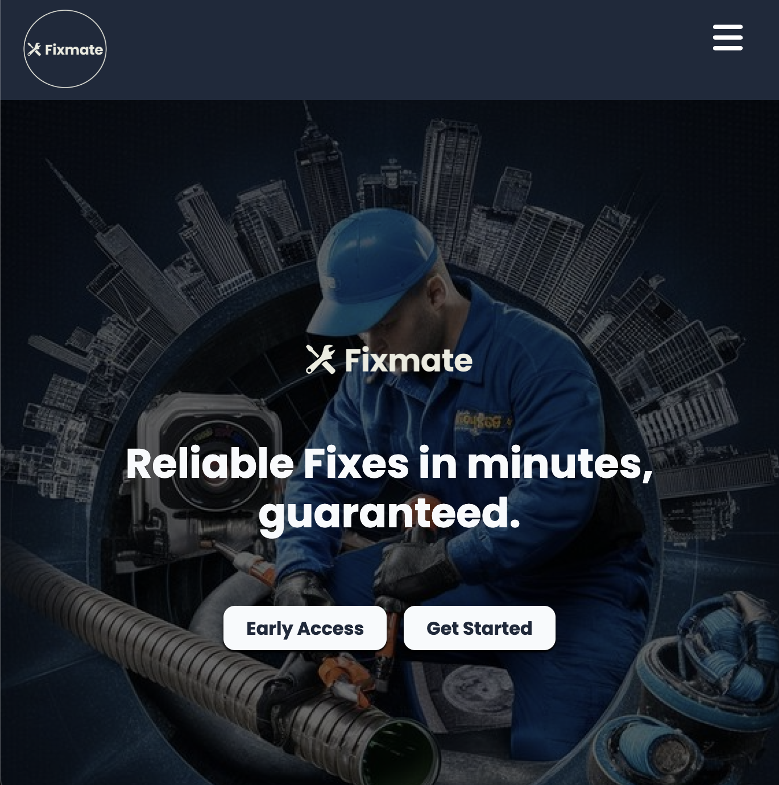
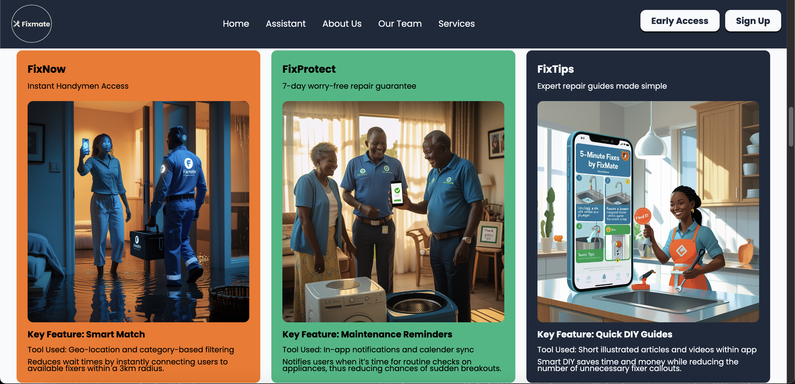

# 🛠️ FixMate – On-Demand Trusted Repairs

## 📖 Overview
**FixMate** is a vetted, on-demand handyman booking platform designed to connect urban residents with trusted, affordable repair services in minutes. Sparked by the frustration of Nairobi’s unreliable repair networks, FixMate ensures:
- **Emergency responses under 30 minutes**
- **Upfront transparent pricing**
- **Quality guarantees backed by a 7-day warranty**

Accessible through a simple mobile-responsive web interface, **FixMate** is the *Uber for handymen*, restoring trust in Africa’s informal trades, one fix at a time.

---

## ✨ Key Features

1. **FixNow:**  
   Get emergency repairs for plumbing, electrical faults, locksmith services, and more within minutes.

2. **FixProtect:**  
   Enjoy a **7-day warranty** on every job done through FixMate, ensuring peace of mind for renters and homeowners.

3. **FixTips:**  
   Access DIY repair guides for quick, minor fixes you can safely tackle yourself.

4. **Vetted Pros:**  
   Every handyman undergoes a **rigorous 3-step verification process** to guarantee reliability and professionalism.

---

## 📊 Impact So Far

- 🚨 **6,500+** urban emergencies successfully resolved  
- 🛠️ **200+** skilled tradespeople empowered through fair, consistent gigs  
- 🌟 **89%** customer satisfaction rate and growing  

---

## 🖥️ Tech Stack

- **Frontend:** HTML, CSS, and JavaScript  
- **Design Tools:** Figma  
- **ChatBot Integration:** Puter.js

---

## 🌐 Live Project Links

- 🔗 **[Website Demo](https://boaz-marube.github.io/fixmate-profile/)**  
- 🎨 **[Figma Design File](https://www.figma.com/design/ylacm0DOp0GpGqcNb8dTUf/FixMate?node-id=0-1&t=fJdFx8TatoFx6YIZ-1)**  

---

## 📷 Project Screenshots

| Hero Section            | Features Section |
|:----------------------:|:----------------|
|  |  |


---

## 📦 How to Run Locally

1. **Clone the repository**
   ```bash
   git clone https://github.com/boaz-marube/fixmate-profile.git
